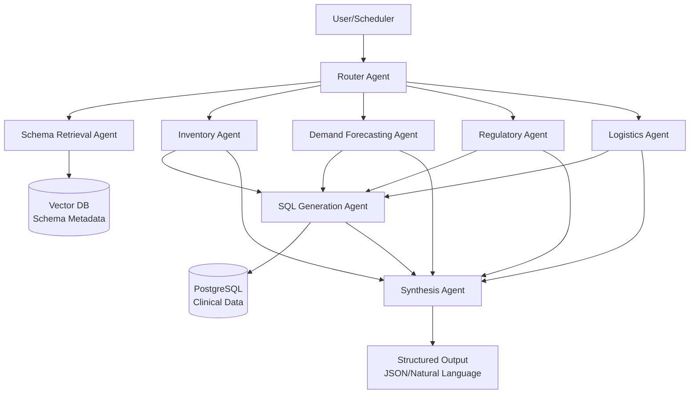

# Clinical Supply Chain Control Tower - Agentic AI System

## Problem Statement

Global Pharma Inc. manages complex clinical trials across 50+ countries with supply chain data fragmented across 40+ disparate tables (SAP dumps, SharePoint lists, Excel trackers). Supply Managers face overwhelming manual data reconciliation, leading to critical risks:

1. **Stock-outs**: Patients not receiving medication due to unexpected enrollment spikes
2. **Waste**: High-value drugs expiring in warehouses due to missed reallocation or life-extension opportunities

The manual nature of current processes creates blind spots in inventory health monitoring and prevents timely decision-making on critical supply chain issues.

## Solution Overview

This Agentic AI System automates risk detection and assists managers in making complex supply decisions through two core workflows:

**Workflow A: Supply Watchdog** - Autonomous monitoring system that runs daily to identify:
- Expiring batches within 90 days (categorized by severity)
- Predicted stock shortfalls based on enrollment trends

**Workflow B: Scenario Strategist** - Conversational assistant that helps managers:
- Evaluate shelf-life extension feasibility
- Answer complex supply chain queries with data-backed recommendations
- Perform multi-constraint analysis (technical, regulatory, logistical)

## Architecture Overview



## Technology Stack

- **Backend**: Python 3.11+
- **Agent Framework**: Custom Multi-Agent (with LangChain-OpenAI for LLM)
- **LLM**: OpenAI GPT-4 / Anthropic Claude
- **Database**: PostgreSQL
- **Vector DB**: ChromaDB
- **Frontend**: Streamlit
- **Deployment**: Streamlit Cloud / Render

## Deployed Application

🚀 **Live Demo**: Ready for deployment to Streamlit Cloud

**Note**: To deploy, follow instructions in `STREAMLIT_GUIDE.md`

## Quick Start

### Prerequisites

- Python 3.11+
- PostgreSQL 14+
- OpenAI API Key or Anthropic API Key

### Installation

```bash
# Clone repository
git clone <repository-url>
cd clinical-supply-control-tower

# Create virtual environment
python -m venv venv
source venv/bin/activate  # On Windows: venv\Scripts\activate

# Install dependencies
pip install -r requirements.txt

# Set environment variables
cp .env.example .env
# Edit .env with your API keys and database URL
```

### Database Setup

```bash
# Load CSV data into PostgreSQL
python scripts/load_data.py

# Initialize vector database with schema metadata
python scripts/init_vector_db.py
```

### Run Application

```bash
# Start Streamlit application
streamlit run app.py
```

## How to Test

### Testing Workflow A (Supply Watchdog)

1. Navigate to the "Monitoring Dashboard" tab
2. Click "Run Supply Watchdog" button
3. Review the generated alerts:
   - Expiry alerts categorized by severity (Critical/High/Medium)
   - Shortfall predictions with estimated stockout dates
4. Export results as JSON using the "Export JSON" button

### Testing Workflow B (Scenario Strategist)

1. Navigate to the "Conversational Assistant" tab
2. Try example queries:
   - "Can we extend the expiry of Batch LOT-14364098 for Germany?"
   - "What is the current stock level for MAT-93657?"
   - "Show me all batches expiring in Taiwan within 60 days"
   - "Has LOT-59019698 been re-evaluated before?"
   - "What is the current inventory level for Product A across all warehouses?"
   - "Which decision is better: increasing inventory now or expediting logistics later?"
3. Observe structured responses with:
   - Direct answers
   - Specific data points
   - Data citations (table names, columns, values)
   - Aggregated duplicates (e.g., if location appears twice, quantities are summed)
   - Reasoning explanations

### Running Automated Tests

```bash
# Run comprehensive compliance test suite
python test_assignment_compliance.py
```

This verifies:
- ✓ Database connectivity and CSV loading
- ✓ Vector DB initialization
- ✓ Workflow A execution
- ✓ Workflow B query processing
- ✓ Multi-agent architecture
- ✓ Edge case handling
- ✓ Data citations

## Documentation

- [Part 1: Architecture Design](docs/01_architecture_design.md)
- [Part 2: Technical Implementation](docs/02_technical_implementation.md)
- [Part 3: Edge Case Handling](docs/03_edge_case_handling.md)

## Project Structure

```
clinical-supply-control-tower/
├── app.py                          # Streamlit application entry point
├── requirements.txt                # Python dependencies
├── .env.example                    # Environment variables template
├── README.md                       # This file
├── docs/                           # Detailed documentation
│   ├── 01_architecture_design.md
│   ├── 02_technical_implementation.md
│   └── 03_edge_case_handling.md
├── src/                            # Source code
│   ├── agents/                     # Agent implementations
│   │   ├── router_agent.py
│   │   ├── schema_retrieval_agent.py
│   │   ├── inventory_agent.py
│   │   ├── demand_forecasting_agent.py
│   │   ├── regulatory_agent.py
│   │   ├── logistics_agent.py
│   │   ├── sql_generation_agent.py
│   │   └── synthesis_agent.py
│   ├── workflows/                  # Workflow orchestration
│   │   ├── workflow_a.py
│   │   └── workflow_b.py
│   ├── tools/                      # Agent tools
│   │   ├── database_tools.py
│   │   ├── vector_db_tools.py
│   │   └── fuzzy_matching.py
│   ├── config/                     # Configuration
│   │   ├── prompts.py
│   │   └── settings.py
│   └── utils/                      # Utilities
│       ├── schema_registry.py
│       └── error_handlers.py
├── scripts/                        # Setup scripts
│   ├── load_data.py
│   └── init_vector_db.py
└── synthetic_clinical_data/        # CSV data files
```

## Key Features

✅ **Zero Hallucinations**: All responses grounded in actual database queries  
✅ **Explainable AI**: Every decision includes data citations (table, column, value)  
✅ **Self-Healing SQL**: Automatic retry logic for failed queries (max 3 attempts)  
✅ **Fuzzy Matching**: Handles ambiguous entity names intelligently  
✅ **Context Management**: Vector DB prevents context window overflow  
✅ **Multi-Agent Collaboration**: Specialized agents with clear separation of concerns  

## Development

### Running Tests

```bash
pytest tests/
```

### Code Quality

```bash
# Format code
black src/

# Lint code
pylint src/
```

## License

**All Rights Reserved**

This project is proprietary. No part of this codebase may be copied, modified, distributed, or used without explicit written permission from the author.


For permission requests, please contact the author directly.

## Contact

For questions or issues, please open a GitHub issue.
