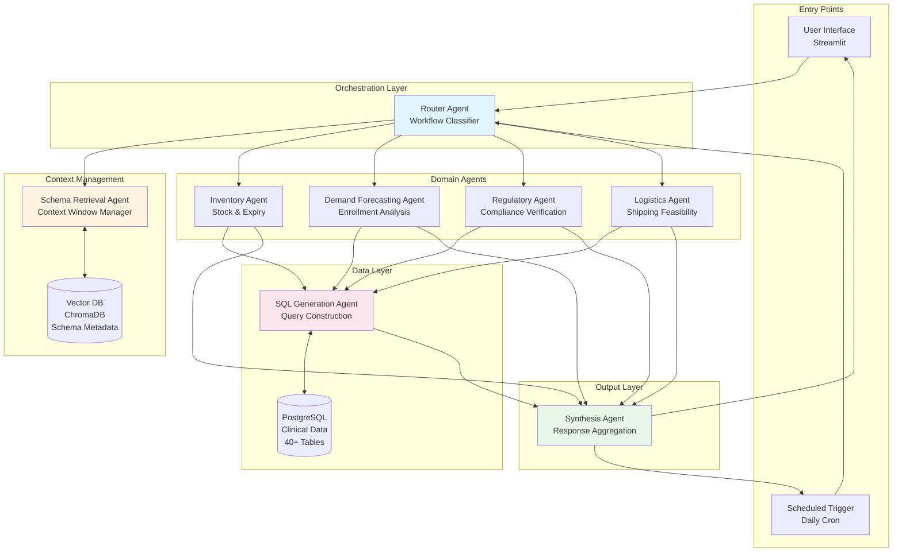

# Part 1: Architecture Design

## System Architecture Overview

The Clinical Supply Chain Control Tower implements a multi-agent architecture using LangGraph for orchestration. The system is designed with clear separation of concerns, where each agent has specific responsibilities and interacts with others through well-defined interfaces.

---

## Quick Reference: Agent Summary

| # | Agent Name | Uses LLM? | Primary Function | Source File |
|---|------------|-----------|------------------|-------------|
| 1 | Router Agent | ❌ No | Classify & route requests | `src/agents/router_agent.py` |
| 2 | Schema Retrieval Agent | ✅ Yes (Embeddings) | Find relevant tables via semantic search | `src/agents/schema_retrieval_agent_v2_openai.py` |
| 3 | SQL Generation Agent | ✅ Yes (GPT-4) | Generate PostgreSQL queries | `src/agents/sql_generation_agent_v2.py` |
| 4 | Inventory Agent | ❌ No | Stock levels & expiry tracking | `src/agents/inventory_agent.py` |
| 5 | Demand Forecasting Agent | ❌ No | Enrollment analysis & shortfall prediction | `src/agents/demand_forecasting_agent.py` |
| 6 | Regulatory Agent | ❌ No | Compliance & approval verification | `src/agents/regulatory_agent.py` |
| 7 | Logistics Agent | ❌ No | Shipping timelines & feasibility | `src/agents/logistics_agent.py` |
| 8 | Synthesis Agent | ✅ Yes (GPT-4) | Aggregate results & generate responses | `src/agents/synthesis_agent.py` |

**Total: 8 Agents** | **3 use LLM** | **5 use rule-based logic**

---

## LLM Usage Strategy

### Where LLM is Used

```
┌─────────────────────────────────────────────────────────────────────────┐
│                        LLM USAGE IN THE SYSTEM                          │
├─────────────────────────────────────────────────────────────────────────┤
│                                                                         │
│  ┌─────────────────┐    ┌─────────────────┐    ┌─────────────────┐     │
│  │ Schema Retrieval│    │ SQL Generation  │    │   Synthesis     │     │
│  │     Agent       │    │     Agent       │    │     Agent       │     │
│  ├─────────────────┤    ├─────────────────┤    ├─────────────────┤     │
│  │ OpenAI          │    │ GPT-4-turbo     │    │ GPT-4-turbo     │     │
│  │ text-embedding- │    │                 │    │                 │     │
│  │ 3-small         │    │ Generates SQL   │    │ Reasons over    │     │
│  │                 │    │ from natural    │    │ data & formats  │     │
│  │ Semantic search │    │ language intent │    │ responses       │     │
│  │ for tables      │    │                 │    │                 │     │
│  └─────────────────┘    └─────────────────┘    └─────────────────┘     │
│                                                                         │
│  WHY THESE 3?                                                           │
│  • Schema Retrieval: Semantic understanding of user intent              │
│  • SQL Generation: Complex query construction from natural language     │
│  • Synthesis: Natural language reasoning and response formatting        │
│                                                                         │
└─────────────────────────────────────────────────────────────────────────┘
```

### Where LLM is NOT Used (Rule-Based)

```
┌─────────────────────────────────────────────────────────────────────────┐
│                    RULE-BASED AGENTS (NO LLM)                           │
├─────────────────────────────────────────────────────────────────────────┤
│                                                                         │
│  ┌──────────────┐  ┌──────────────┐  ┌──────────────┐  ┌──────────────┐│
│  │    Router    │  │  Inventory   │  │   Demand     │  │  Regulatory  ││
│  │    Agent     │  │    Agent     │  │  Forecasting │  │    Agent     ││
│  ├──────────────┤  ├──────────────┤  ├──────────────┤  ├──────────────┤│
│  │ Keyword      │  │ SQL queries  │  │ Statistical  │  │ SQL queries  ││
│  │ matching &   │  │ for stock &  │  │ calculations │  │ for RIM &    ││
│  │ regex for    │  │ expiry data  │  │ for demand   │  │ re-evaluation││
│  │ routing      │  │              │  │ projection   │  │              ││
│  └──────────────┘  └──────────────┘  └──────────────┘  └──────────────┘│
│                                                                         │
│  ┌──────────────┐                                                       │
│  │  Logistics   │  WHY NO LLM?                                          │
│  │    Agent     │  • Deterministic operations (date math, comparisons)  │
│  ├──────────────┤  • Faster execution (no API calls)                    │
│  │ Date calcs & │  • Lower cost (no token usage)                        │
│  │ shipping     │  • More predictable behavior                          │
│  │ feasibility  │                                                       │
│  └──────────────┘                                                       │
│                                                                         │
└─────────────────────────────────────────────────────────────────────────┘
```

---

## Detailed Agent Specifications

### Agent 1: Router Agent

```
┌─────────────────────────────────────────────────────────────────────────┐
│ ROUTER AGENT                                                            │
├─────────────────────────────────────────────────────────────────────────┤
│ File: src/agents/router_agent.py                                        │
│ Uses LLM: ❌ No (keyword matching + regex)                              │
├─────────────────────────────────────────────────────────────────────────┤
│ PURPOSE:                                                                │
│ Entry point for all requests. Classifies intent and routes to          │
│ appropriate workflow and agents.                                        │
├─────────────────────────────────────────────────────────────────────────┤
│ RESPONSIBILITIES:                                                       │
│ • Classify request as Workflow A (monitoring) or B (conversational)    │
│ • Extract entities (batch IDs, countries, materials, trials)           │
│ • Determine which domain agents are needed                              │
│ • Handle ambiguous requests                                             │
├─────────────────────────────────────────────────────────────────────────┤
│ INPUTS:                                                                 │
│ • User query (string)                                                   │
│ • Context (optional dict)                                               │
├─────────────────────────────────────────────────────────────────────────┤
│ OUTPUTS:                                                                │
│ • workflow: "A" or "B"                                                  │
│ • intent: Description of user intent                                    │
│ • required_agents: List of agents to invoke                             │
│ • entities: Extracted batch IDs, countries, etc.                        │
├─────────────────────────────────────────────────────────────────────────┤
│ TABLES ACCESSED: None (no database access)                              │
├─────────────────────────────────────────────────────────────────────────┤
│ INTERACTS WITH:                                                         │
│ → Schema Retrieval Agent (requests relevant schemas)                    │
│ → All Domain Agents (routes requests)                                   │
└─────────────────────────────────────────────────────────────────────────┘
```

### Agent 2: Schema Retrieval Agent

```
┌─────────────────────────────────────────────────────────────────────────┐
│ SCHEMA RETRIEVAL AGENT                                                  │
├─────────────────────────────────────────────────────────────────────────┤
│ File: src/agents/schema_retrieval_agent_v2_openai.py                    │
│ Uses LLM: ✅ Yes (OpenAI text-embedding-3-small)                        │
├─────────────────────────────────────────────────────────────────────────┤
│ PURPOSE:                                                                │
│ Manages context window by finding only relevant table schemas           │
│ from 40+ tables using semantic search.                                  │
├─────────────────────────────────────────────────────────────────────────┤
│ RESPONSIBILITIES:                                                       │
│ • Query ChromaDB vector database for relevant schemas                   │
│ • Return max 5 most relevant tables per request                         │
│ • Format schemas for LLM consumption                                    │
│ • Prevent context window overflow                                       │
├─────────────────────────────────────────────────────────────────────────┤
│ HOW IT WORKS:                                                           │
│ 1. User query → OpenAI embedding                                        │
│ 2. Embedding → ChromaDB similarity search                               │
│ 3. Top 5 tables → Schema formatting                                     │
│ 4. Formatted schemas → Domain agents                                    │
├─────────────────────────────────────────────────────────────────────────┤
│ INPUTS:                                                                 │
│ • query: User query string                                              │
│ • workflow: "A" or "B" (optional filter)                                │
│ • n_results: Number of tables to return (default 5)                     │
├─────────────────────────────────────────────────────────────────────────┤
│ OUTPUTS:                                                                │
│ • table_names: List of relevant table names                             │
│ • formatted_schemas: Schema text for LLM                                │
│ • similarity_scores: Relevance scores per table                         │
├─────────────────────────────────────────────────────────────────────────┤
│ TABLES ACCESSED: None (queries ChromaDB only)                           │
├─────────────────────────────────────────────────────────────────────────┤
│ INTERACTS WITH:                                                         │
│ ↔ ChromaDB (vector similarity search)                                   │
│ → All Domain Agents (provides schemas)                                  │
│ → SQL Generation Agent (provides schemas)                               │
└─────────────────────────────────────────────────────────────────────────┘
```

### Agent 3: SQL Generation Agent

```
┌─────────────────────────────────────────────────────────────────────────┐
│ SQL GENERATION AGENT                                                    │
├─────────────────────────────────────────────────────────────────────────┤
│ File: src/agents/sql_generation_agent_v2.py                             │
│ Uses LLM: ✅ Yes (GPT-4-turbo for query generation)                     │
├─────────────────────────────────────────────────────────────────────────┤
│ PURPOSE:                                                                │
│ Converts natural language intent into valid PostgreSQL queries          │
│ with self-healing retry logic.                                          │
├─────────────────────────────────────────────────────────────────────────┤
│ RESPONSIBILITIES:                                                       │
│ • Generate PostgreSQL queries from intent + schema                      │
│ • Execute queries against database                                      │
│ • Implement self-healing (3 retry attempts)                             │
│ • Auto-fix common issues (date casting, column names)                   │
│ • Parse and translate error messages                                    │
├─────────────────────────────────────────────────────────────────────────┤
│ SELF-HEALING LOOP:                                                      │
│ ┌─────────────────────────────────────────────────────────────────┐    │
│ │ Attempt 1: Generate query from intent                           │    │
│ │     ↓ (if error)                                                │    │
│ │ Attempt 2: Analyze error, fix query                             │    │
│ │     ↓ (if error)                                                │    │
│ │ Attempt 3: Refresh schema, regenerate                           │    │
│ │     ↓ (if error)                                                │    │
│ │ Return error with helpful message                               │    │
│ └─────────────────────────────────────────────────────────────────┘    │
├─────────────────────────────────────────────────────────────────────────┤
│ INPUTS:                                                                 │
│ • intent: What to query                                                 │
│ • table_names: Tables to query                                          │
│ • schemas: Table schema information                                     │
│ • filters: Query filters (batch_id, country, etc.)                      │
├─────────────────────────────────────────────────────────────────────────┤
│ OUTPUTS:                                                                │
│ • success: Boolean                                                      │
│ • query: Generated SQL                                                  │
│ • data: Query results                                                   │
│ • row_count: Number of rows returned                                    │
├─────────────────────────────────────────────────────────────────────────┤
│ TABLES ACCESSED: All tables (as needed by domain agents)                │
├─────────────────────────────────────────────────────────────────────────┤
│ INTERACTS WITH:                                                         │
│ ↔ PostgreSQL (executes queries)                                         │
│ ← All Domain Agents (receives query requests)                           │
│ ← Schema Retrieval Agent (receives schemas)                             │
└─────────────────────────────────────────────────────────────────────────┘
```

### Agent 4: Inventory Agent

```
┌─────────────────────────────────────────────────────────────────────────┐
│ INVENTORY AGENT                                                         │
├─────────────────────────────────────────────────────────────────────────┤
│ File: src/agents/inventory_agent.py                                     │
│ Uses LLM: ❌ No (rule-based SQL queries)                                │
├─────────────────────────────────────────────────────────────────────────┤
│ PURPOSE:                                                                │
│ Manages inventory-related queries including stock levels,               │
│ batch locations, and expiry tracking.                                   │
├─────────────────────────────────────────────────────────────────────────┤
│ RESPONSIBILITIES:                                                       │
│ • Check current stock levels                                            │
│ • Identify expiring ALLOCATED batches (≤90 days)                        │
│ • Classify expiry severity (Critical/High/Medium)                       │
│ • Track batch locations across warehouses                               │
├─────────────────────────────────────────────────────────────────────────┤
│ TABLES ACCESSED:                                                        │
│ • allocated_materials_to_orders (PRIMARY - reserved batches)            │
│ • batch_master (expiry dates)                                           │
│ • available_inventory_report (current stock)                            │
│ • affiliate_warehouse_inventory (warehouse locations)                   │
├─────────────────────────────────────────────────────────────────────────┤
│ OPERATIONS:                                                             │
│ • get_expiring_batches(days=90) → Expiring allocated batches            │
│ • get_stock_level(material_id) → Current inventory                      │
│ • get_batch_info(batch_id) → Batch details                              │
├─────────────────────────────────────────────────────────────────────────┤
│ INTERACTS WITH:                                                         │
│ → SQL Generation Agent (sends query requests)                           │
│ → Synthesis Agent (sends results)                                       │
│ ↔ Demand Agent (for shortfall calculations)                             │
└─────────────────────────────────────────────────────────────────────────┘
```

### Agent 5: Demand Forecasting Agent

```
┌─────────────────────────────────────────────────────────────────────────┐
│ DEMAND FORECASTING AGENT                                                │
├─────────────────────────────────────────────────────────────────────────┤
│ File: src/agents/demand_forecasting_agent.py                            │
│ Uses LLM: ❌ No (statistical calculations)                              │
├─────────────────────────────────────────────────────────────────────────┤
│ PURPOSE:                                                                │
│ Analyzes enrollment data to project demand and predict                  │
│ potential stock shortfalls.                                             │
├─────────────────────────────────────────────────────────────────────────┤
│ RESPONSIBILITIES:                                                       │
│ • Calculate enrollment rates by country/trial                           │
│ • Project 8-week demand based on enrollment trends                      │
│ • Compare projected demand vs current inventory                         │
│ • Identify shortfall risks                                              │
├─────────────────────────────────────────────────────────────────────────┤
│ TABLES ACCESSED:                                                        │
│ • enrollment_rate_report (enrollment trends)                            │
│ • country_level_enrollment_report (country breakdown)                   │
│ • study_level_enrollment_report (trial breakdown)                       │
├─────────────────────────────────────────────────────────────────────────┤
│ CALCULATIONS:                                                           │
│ • Weekly enrollment rate = enrolled_patients / weeks                    │
│ • 8-week demand = weekly_rate × 8 × doses_per_patient                   │
│ • Shortfall = projected_demand - current_inventory                      │
├─────────────────────────────────────────────────────────────────────────┤
│ INTERACTS WITH:                                                         │
│ → SQL Generation Agent (sends query requests)                           │
│ → Synthesis Agent (sends results)                                       │
│ ↔ Inventory Agent (gets current stock levels)                           │
└─────────────────────────────────────────────────────────────────────────┘
```

### Agent 6: Regulatory Agent

```
┌─────────────────────────────────────────────────────────────────────────┐
│ REGULATORY AGENT                                                        │
├─────────────────────────────────────────────────────────────────────────┤
│ File: src/agents/regulatory_agent.py                                    │
│ Uses LLM: ❌ No (rule-based compliance checks)                          │
├─────────────────────────────────────────────────────────────────────────┤
│ PURPOSE:                                                                │
│ Verifies regulatory compliance for shelf-life extensions                │
│ and country-specific requirements.                                      │
├─────────────────────────────────────────────────────────────────────────┤
│ RESPONSIBILITIES:                                                       │
│ • Check re-evaluation history (has batch been extended before?)         │
│ • Verify country approval status                                        │
│ • Validate regulatory submission status                                 │
│ • Map countries to health authorities (EMA, FDA, PMDA, etc.)            │
├─────────────────────────────────────────────────────────────────────────┤
│ TABLES ACCESSED:                                                        │
│ • re_evaluation (extension history - TECHNICAL CHECK)                   │
│ • rim (regulatory information - REGULATORY CHECK)                       │
│ • material_country_requirements (country approvals)                     │
│ • qdocs (quality documents)                                             │
├─────────────────────────────────────────────────────────────────────────┤
│ CHECKS PERFORMED:                                                       │
│ • Technical: Has material been re-evaluated? (max 3 extensions)         │
│ • Regulatory: Is extension approved in target country?                  │
├─────────────────────────────────────────────────────────────────────────┤
│ INTERACTS WITH:                                                         │
│ → SQL Generation Agent (sends query requests)                           │
│ → Synthesis Agent (sends results)                                       │
└─────────────────────────────────────────────────────────────────────────┘
```

### Agent 7: Logistics Agent

```
┌─────────────────────────────────────────────────────────────────────────┐
│ LOGISTICS AGENT                                                         │
├─────────────────────────────────────────────────────────────────────────┤
│ File: src/agents/logistics_agent.py                                     │
│ Uses LLM: ❌ No (date calculations)                                     │
├─────────────────────────────────────────────────────────────────────────┤
│ PURPOSE:                                                                │
│ Assesses shipping feasibility and logistics timelines                   │
│ for redistribution or extension scenarios.                              │
├─────────────────────────────────────────────────────────────────────────┤
│ RESPONSIBILITIES:                                                       │
│ • Calculate shipping times to target countries                          │
│ • Assess if there's enough time before expiry                           │
│ • Account for processing buffers (14-day minimum)                       │
│ • Evaluate redistribution feasibility                                   │
├─────────────────────────────────────────────────────────────────────────┤
│ TABLES ACCESSED:                                                        │
│ • ip_shipping_timelines_report (shipping durations - LOGISTICAL CHECK)  │
│ • distribution_order_report (order status)                              │
│ • shipment_status_report (shipment tracking)                            │
├─────────────────────────────────────────────────────────────────────────┤
│ CALCULATIONS:                                                           │
│ • Available window = expiry_date - today                                │
│ • Required time = shipping_days + buffer (14 days)                      │
│ • Feasible = available_window > required_time                           │
├─────────────────────────────────────────────────────────────────────────┤
│ INTERACTS WITH:                                                         │
│ → SQL Generation Agent (sends query requests)                           │
│ → Synthesis Agent (sends results)                                       │
│ ← Inventory Agent (receives batch expiry info)                          │
└─────────────────────────────────────────────────────────────────────────┘
```

### Agent 8: Synthesis Agent

```
┌─────────────────────────────────────────────────────────────────────────┐
│ SYNTHESIS AGENT                                                         │
├─────────────────────────────────────────────────────────────────────────┤
│ File: src/agents/synthesis_agent.py                                     │
│ Uses LLM: ✅ Yes (GPT-4-turbo for reasoning & formatting)               │
├─────────────────────────────────────────────────────────────────────────┤
│ PURPOSE:                                                                │
│ Aggregates outputs from all agents and generates final                  │
│ response with citations and reasoning.                                  │
├─────────────────────────────────────────────────────────────────────────┤
│ RESPONSIBILITIES:                                                       │
│ • Aggregate data from multiple domain agents                            │
│ • Generate structured JSON (Workflow A)                                 │
│ • Generate natural language responses (Workflow B)                      │
│ • Include data citations for all findings                               │
│ • Provide explicit reasoning for YES/NO decisions                       │
├─────────────────────────────────────────────────────────────────────────┤
│ OUTPUT FORMATS:                                                         │
│                                                                         │
│ Workflow A (JSON):                                                      │
│ {                                                                       │
│   "alert_date": "2025-12-26",                                           │
│   "expiry_alerts": [...],                                               │
│   "shortfall_predictions": [...]                                        │
│ }                                                                       │
│                                                                         │
│ Workflow B (Natural Language):                                          │
│ "CAN WE EXTEND BATCH LOT-123 FOR GERMANY?                               │
│  Answer: YES                                                            │
│  Technical Check: ✓ PASS                                                │
│  Regulatory Check: ✓ PASS                                               │
│  Logistical Check: ✓ PASS                                               │
│  RECOMMENDATION: Proceed with extension..."                             │
├─────────────────────────────────────────────────────────────────────────┤
│ TABLES ACCESSED: None (aggregates only)                                 │
├─────────────────────────────────────────────────────────────────────────┤
│ INTERACTS WITH:                                                         │
│ ← All Domain Agents (receives results)                                  │
│ → User Interface (sends final response)                                 │
└─────────────────────────────────────────────────────────────────────────┘
```

---

## Clear Separation of Concerns

```
┌─────────────────────────────────────────────────────────────────────────┐
│                    SEPARATION OF CONCERNS                               │
├─────────────────────────────────────────────────────────────────────────┤
│                                                                         │
│  LAYER 1: ROUTING (No DB Access)                                        │
│  ┌─────────────────────────────────────────────────────────────────┐   │
│  │ Router Agent                                                     │   │
│  │ • ONLY classifies intent and routes                              │   │
│  │ • NEVER queries database                                         │   │
│  │ • NEVER generates SQL                                            │   │
│  └─────────────────────────────────────────────────────────────────┘   │
│                                                                         │
│  LAYER 2: CONTEXT MANAGEMENT (Vector DB Only)                           │
│  ┌─────────────────────────────────────────────────────────────────┐   │
│  │ Schema Retrieval Agent                                           │   │
│  │ • ONLY queries ChromaDB for schemas                              │   │
│  │ • NEVER queries PostgreSQL                                       │   │
│  │ • NEVER executes business logic                                  │   │
│  └─────────────────────────────────────────────────────────────────┘   │
│                                                                         │
│  LAYER 3: DOMAIN LOGIC (Business Rules)                                 │
│  ┌─────────────────────────────────────────────────────────────────┐   │
│  │ Inventory │ Demand │ Regulatory │ Logistics                      │   │
│  │ • ONLY handle their specific domain                              │   │
│  │ • NEVER access tables outside their scope                        │   │
│  │ • NEVER format final responses                                   │   │
│  └─────────────────────────────────────────────────────────────────┘   │
│                                                                         │
│  LAYER 4: DATA ACCESS (SQL Only)                                        │
│  ┌─────────────────────────────────────────────────────────────────┐   │
│  │ SQL Generation Agent                                             │   │
│  │ • ONLY generates and executes SQL                                │   │
│  │ • NEVER interprets business meaning                              │   │
│  │ • NEVER formats user responses                                   │   │
│  └─────────────────────────────────────────────────────────────────┘   │
│                                                                         │
│  LAYER 5: OUTPUT (Response Only)                                        │
│  ┌─────────────────────────────────────────────────────────────────┐   │
│  │ Synthesis Agent                                                  │   │
│  │ • ONLY aggregates and formats                                    │   │
│  │ • NEVER queries database                                         │   │
│  │ • NEVER makes routing decisions                                  │   │
│  └─────────────────────────────────────────────────────────────────┘   │
│                                                                         │
└─────────────────────────────────────────────────────────────────────────┘
```

---

## Agent-to-Table Mapping

```
┌─────────────────────────────────────────────────────────────────────────┐
│                    WHICH AGENT ACCESSES WHICH TABLES                    │
├─────────────────────────────────────────────────────────────────────────┤
│                                                                         │
│  INVENTORY AGENT                                                        │
│  ├── allocated_materials_to_orders  ← Reserved batches (Workflow A)     │
│  ├── batch_master                   ← Expiry dates                      │
│  ├── available_inventory_report     ← Current stock                     │
│  └── affiliate_warehouse_inventory  ← Warehouse locations               │
│                                                                         │
│  DEMAND FORECASTING AGENT                                               │
│  ├── enrollment_rate_report         ← Enrollment trends                 │
│  ├── country_level_enrollment_report← Country breakdown                 │
│  └── study_level_enrollment_report  ← Trial breakdown                   │
│                                                                         │
│  REGULATORY AGENT                                                       │
│  ├── re_evaluation                  ← Extension history (Technical)     │
│  ├── rim                            ← Regulatory approvals              │
│  ├── material_country_requirements  ← Country requirements              │
│  └── qdocs                          ← Quality documents                 │
│                                                                         │
│  LOGISTICS AGENT                                                        │
│  ├── ip_shipping_timelines_report   ← Shipping times (Logistical)       │
│  ├── distribution_order_report      ← Order status                      │
│  └── shipment_status_report         ← Shipment tracking                 │
│                                                                         │
│  SQL GENERATION AGENT                                                   │
│  └── ALL TABLES (as requested by domain agents)                         │
│                                                                         │
│  ROUTER, SCHEMA RETRIEVAL, SYNTHESIS                                    │
│  └── NO DIRECT TABLE ACCESS                                             │
│                                                                         │
└─────────────────────────────────────────────────────────────────────────┘
```

---

---

## Data Flow: Shelf-Life Extension Query

```
┌─────────────────────────────────────────────────────────────────────────┐
│ USER QUERY: "Can we extend Batch LOT-45953393 for Japan?"               │
└─────────────────────────────────────────────────────────────────────────┘
                                    │
                                    ▼
┌─────────────────────────────────────────────────────────────────────────┐
│ STEP 1: ROUTER AGENT                                                    │
│ • Extracts: batch_id="LOT-45953393", country="Japan"                    │
│ • Classifies: Workflow B, shelf-life extension query                    │
│ • Routes to: Inventory + Regulatory + Logistics agents                  │
└─────────────────────────────────────────────────────────────────────────┘
                                    │
                                    ▼
┌─────────────────────────────────────────────────────────────────────────┐
│ STEP 2: SCHEMA RETRIEVAL AGENT (uses OpenAI embeddings)                 │
│ • Query: "shelf life extension batch Japan"                             │
│ • Returns: re_evaluation, material_country_requirements,                │
│            ip_shipping_timelines_report                                 │
└─────────────────────────────────────────────────────────────────────────┘
                                    │
                    ┌───────────────┼───────────────┐
                    ▼               ▼               ▼
┌─────────────────────┐ ┌─────────────────────┐ ┌─────────────────────┐
│ TECHNICAL CHECK     │ │ REGULATORY CHECK    │ │ LOGISTICAL CHECK    │
│ (re_evaluation)     │ │ (material_country_  │ │ (ip_shipping_       │
│                     │ │  requirements)      │ │  timelines_report)  │
│ SQL: SELECT * FROM  │ │ SQL: SELECT * FROM  │ │ SQL: SELECT * FROM  │
│ re_evaluation WHERE │ │ material_country_   │ │ ip_shipping_        │
│ lot_number ILIKE    │ │ requirements WHERE  │ │ timelines_report    │
│ '%LOT-45953393%'    │ │ countries ILIKE     │ │ WHERE country_name  │
│                     │ │ '%Japan%'           │ │ ILIKE '%Japan%'     │
│                     │ │                     │ │                     │
│ Result: 1 record    │ │ Result: 3 records   │ │ Result: 0 records   │
│ Status: ✓ PASS      │ │ Status: ✓ PASS      │ │ Status: ⚠ INDET.    │
└─────────────────────┘ └─────────────────────┘ └─────────────────────┘
                    │               │               │
                    └───────────────┼───────────────┘
                                    ▼
┌─────────────────────────────────────────────────────────────────────────┐
│ STEP 4: SYNTHESIS AGENT (uses GPT-4 for reasoning)                      │
│ • Aggregates all 3 check results                                        │
│ • Determines: CONDITIONAL (logistics data missing)                      │
│ • Generates response with citations                                     │
└─────────────────────────────────────────────────────────────────────────┘
                                    │
                                    ▼
┌─────────────────────────────────────────────────────────────────────────┐
│ FINAL RESPONSE:                                                         │
│                                                                         │
│ CAN WE EXTEND BATCH LOT-45953393 FOR Japan?                             │
│                                                                         │
│ Answer: CONDITIONAL                                                     │
│                                                                         │
│ Technical Check: ✓ PASS                                                 │
│ Finding: Found 1 prior re-evaluation record(s)                          │
│ Source: re_evaluation                                                   │
│                                                                         │
│ Regulatory Check: ✓ PASS                                                │
│ Finding: Found 3 regulatory record(s) for Japan                         │
│ Source: material_country_requirements                                   │
│                                                                         │
│ Logistical Check: ⚠ INDETERMINATE                                       │
│ Finding: Could not retrieve shipping timeline data for Japan            │
│ Source: ip_shipping_timelines_report                                    │
│                                                                         │
│ RECOMMENDATION: Requires additional verification.                       │
└─────────────────────────────────────────────────────────────────────────┘
```

---

### High-Level Architecture Diagram



## Agent Definitions

| Agent Name | Responsibilities | Tables Accessed | Tools Used | Interacts With |
|------------|-----------------|-----------------|------------|----------------|
| **Router Agent** | - Classify requests as Workflow A or B<br/>- Route to appropriate agents<br/>- Handle ambiguous requests | None (no direct DB access) | - Intent classification<br/>- Keyword matching | - All domain agents<br/>- Schema Retrieval Agent |
| **Schema Retrieval Agent** | - Query vector DB for relevant schemas<br/>- Return max 5 tables per request<br/>- Manage context window | None (queries vector DB only) | - Vector similarity search<br/>- Schema formatting | - Vector DB<br/>- All domain agents |
| **Inventory Agent** | - Check stock levels<br/>- Identify expiring ALLOCATED batches (per assignment)<br/>- Calculate available vs allocated | - **allocated_materials_to_orders** (PRIMARY for expiry alerts)<br/>- **batch_master** (for expiry dates via JOIN)<br/>- available_inventory_report<br/>- affiliate_warehouse_inventory | - SQL Generation Agent<br/>- Schema Retrieval Agent | - SQL Agent<br/>- Synthesis Agent<br/>- Demand Agent |
| **Demand Forecasting Agent** | - Calculate enrollment rates<br/>- Project future demand<br/>- Predict stockout dates | - enrollment_rate_report<br/>- country_level_enrollment_report<br/>- study_level_enrollment_report | - SQL Generation Agent<br/>- Statistical calculations | - SQL Agent<br/>- Synthesis Agent<br/>- Inventory Agent |
| **Regulatory Agent** | - Check extension approvals<br/>- Verify re-evaluation history<br/>- Validate compliance | - rim<br/>- material_country_requirements<br/>- re-evaluation<br/>- qdocs | - SQL Generation Agent<br/>- Schema Retrieval Agent | - SQL Agent<br/>- Synthesis Agent |
| **Logistics Agent** | - Calculate shipping times<br/>- Assess redistribution feasibility<br/>- Account for buffers | - ip_shipping_timelines_report<br/>- distribution_order_report<br/>- shipment_status_report | - SQL Generation Agent<br/>- Date calculations | - SQL Agent<br/>- Synthesis Agent<br/>- Inventory Agent |
| **SQL Generation Agent** | - Convert intent to PostgreSQL<br/>- Implement self-healing (3 retries)<br/>- Parse error messages | All tables (as needed) | - Query generation<br/>- Syntax validation<br/>- Error analysis | - PostgreSQL<br/>- All domain agents<br/>- Schema Retrieval Agent |
| **Synthesis Agent** | - Aggregate multi-agent outputs<br/>- Format JSON (Workflow A)<br/>- Format natural language (Workflow B) | None (aggregates only) | - JSON formatting<br/>- Citation management<br/>- Response structuring | - All domain agents<br/>- User interface |

## Workflow A: Supply Watchdog (Autonomous Monitoring)

### Flowchart


### Execution Steps

1. **Trigger**: Scheduled cron job (daily at 8 AM, configurable) or manual trigger via UI
2. **Router Classification**: Identifies as Workflow A
3. **Schema Retrieval**: Gets schemas for:
   - **allocated_materials_to_orders** (reserved batches - per assignment requirement)
   - **batch_master** (expiry dates via JOIN)
   - enrollment_rate_report
   - available_inventory_report (for shortfall calculation)
4. **Parallel Agent Execution**:
   - **Inventory Agent**: Queries expiring ALLOCATED batches (JOIN with batch_master for expiry dates)
   - **Demand Forecasting Agent**: Calculates shortfalls
5. **SQL Generation**: Converts intents to PostgreSQL queries
6. **Data Processing**:
   - Classify expiry severity (Critical <30, High 30-60, Medium 60-90 days)
   - Calculate 8-week demand projections
   - Identify shortfalls
7. **Synthesis**: Aggregates results into structured JSON
8. **Output**: JSON payload sent via email (Resend API) and displayed on dashboard

## Workflow B: Scenario Strategist (Conversational Assistant)

### Flowchart


### Example: Shelf-Life Extension Query

**User Query**: "Can we extend the expiry of Batch LOT-14364098 for Germany?"

**Execution Flow**:

1. **Router**: Classifies as Workflow B, complex decision query
2. **Schema Retrieval**: Retrieves schemas for:
   - allocated_materials_to_orders (batch info)
   - re-evaluation (extension history)
   - rim (regulatory approvals)
   - ip_shipping_timelines_report (logistics)
3. **Parallel Agent Execution**:
   - **Inventory Agent**: 
     - Queries batch existence and expiry date
     - Returns: "LOT-14364098 expires 2028-06-06"
   - **Regulatory Agent**:
     - Checks re-evaluation table for previous extensions
     - Checks rim table for Germany approval
     - Returns: "Extended 1 time, approved in Germany"
   - **Logistics Agent**:
     - Calculates days until expiry
     - Checks shipping time to Germany
     - Returns: "Available window: 1200+ days"
4. **Synthesis Agent**:
   - Aggregates all checks
   - Formats structured response with citations
   - Generates recommendation: "YES"

## Design Rationale

### Why Multi-Agent Architecture?

1. **Separation of Concerns**: Each agent has a single, well-defined responsibility
2. **Scalability**: New agents can be added without modifying existing ones
3. **Maintainability**: Bugs and updates are isolated to specific agents
4. **Parallel Execution**: Independent agents can run concurrently
5. **Testability**: Each agent can be tested in isolation

### Why Vector Database for Schema Management?

**Problem**: 40+ tables cannot fit in LLM context window simultaneously

**Solution**: Vector DB stores schema metadata, retrieves only relevant tables

**Benefits**:
- **Context Window Efficiency**: Only 2-5 relevant tables loaded per query
- **Semantic Search**: Finds tables based on intent, not just keywords
- **Scalability**: Can handle hundreds of tables without context overflow
- **Fast Retrieval**: Sub-second schema lookups

**What's Stored**:
- Table descriptions (business purpose)
- Column metadata (name, type, description, examples)
- Relationship patterns (common JOINs)
- Query templates (example SQL patterns)

**What's NOT Stored**:
- Actual business data (only metadata)
- Query results
- User data

### Why LangGraph?

1. **State Management**: Built-in state management for multi-agent workflows
2. **Graph-Based Orchestration**: Natural representation of agent interactions
3. **Conditional Routing**: Easy implementation of workflow branching
4. **Error Handling**: Robust error propagation and recovery
5. **Observability**: Built-in logging and debugging tools

### Trade-offs Considered

| Decision | Alternative | Why Chosen |
|----------|-------------|------------|
| **Multi-Agent** | Single monolithic agent | Better separation of concerns, easier maintenance |
| **Vector DB** | Load all schemas in prompt | Prevents context window overflow, faster retrieval |
| **PostgreSQL** | NoSQL database | Structured data with complex joins, ACID compliance |
| **LangGraph** | Custom orchestration | Proven framework, reduces development time |
| **Streamlit** | React/Vue.js | Faster development, Python-native, easy deployment |
| **ChromaDB** | Pinecone/Weaviate | Open-source, local deployment, no API costs |

## Agent Interaction Patterns

### Pattern 1: Simple Query (Single Agent)
```
User → Router → Schema Retrieval → Inventory Agent → SQL Agent → PostgreSQL → Synthesis → User
```
**Example**: "What is stock level for MAT-93657?"

### Pattern 2: Complex Decision (Multi-Agent)
```
User → Router → Schema Retrieval → [Inventory + Regulatory + Logistics] → SQL Agent → PostgreSQL → Synthesis → User
```
**Example**: "Can we extend Batch #123 for Germany?"

### Pattern 3: Autonomous Monitoring (Scheduled)
```
Scheduler → Router → [Inventory + Demand] → SQL Agent → PostgreSQL → Synthesis → JSON Output
```
**Example**: Daily supply watchdog execution

## Scalability Considerations

### Current Design Supports:
- 40+ tables (tested with synthetic data)
- Concurrent user queries (Streamlit handles multiple sessions)
- Daily scheduled workflows
- Sub-10-second response times for typical queries

### Future Enhancements:
- **Caching Layer**: Redis for frequently accessed data
- **Background Jobs**: Celery for long-running workflows
- **Load Balancing**: Multiple agent instances
- **Monitoring**: Prometheus + Grafana for observability
- **API Gateway**: RESTful API for external integrations

## Security Considerations

### Current Implementation:
- Parameterized SQL queries (prevents SQL injection)
- Environment variables for secrets
- No authentication (as per assignment requirements)

### Production Requirements:
- OAuth 2.0 / SAML authentication
- Role-based access control (RBAC)
- Audit logging for all queries
- Data encryption at rest and in transit
- API rate limiting
- Input sanitization and validation

## Conclusion

This architecture provides a robust, scalable foundation for the Clinical Supply Chain Control Tower. The multi-agent design ensures maintainability and extensibility, while the vector database strategy solves the context window problem elegantly. The system is production-ready for the specified workflows and can be extended to support additional use cases with minimal modifications.
