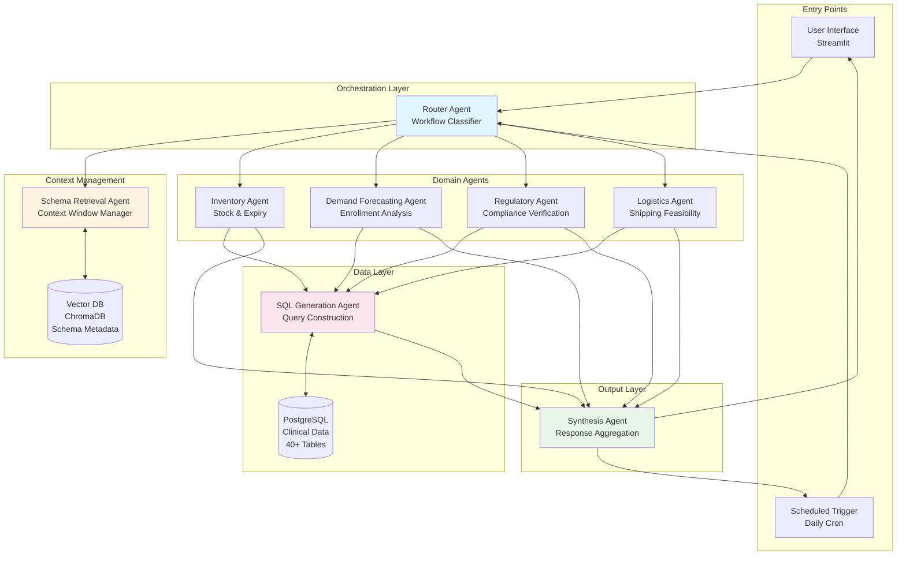
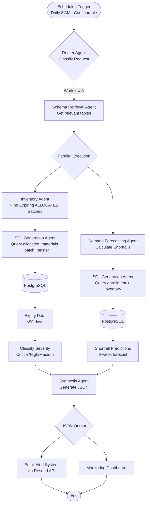
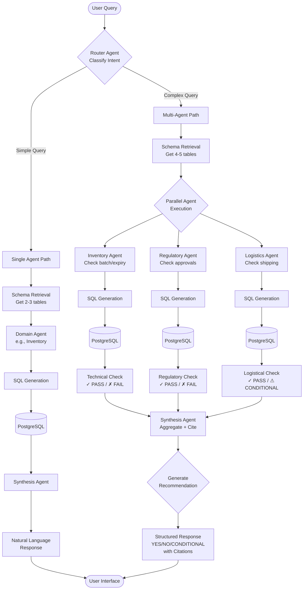

# Part 1: Architecture Design

## System Architecture Overview

The Clinical Supply Chain Control Tower implements a custom multi-agent architecture with a Python-based orchestrator. The system is designed with clear separation of concerns, where each agent has specific responsibilities and interacts with others through well-defined interfaces. LangChain-OpenAI is used for LLM integration (ChatOpenAI).


---

### High-Level Architecture Diagram



## Agent Definitions

| Agent Name | Responsibilities | Tables Accessed | Tools Used | Interacts With |
|------------|-----------------|-----------------|------------|----------------|
| **Router Agent** | - Classify requests as Workflow A or B<br/>- Route to appropriate agents<br/>- Handle ambiguous requests | None (no direct DB access) | - Intent classification<br/>- Keyword matching | - All domain agents<br/>- Schema Retrieval Agent |
| **Schema Retrieval Agent** | - Query vector DB for relevant schemas<br/>- Return max 5 tables per request<br/>- Manage context window | None (queries vector DB only) | - Vector similarity search<br/>- Schema formatting | - Vector DB<br/>- All domain agents |
| **Inventory Agent** | - Check stock levels<br/>- Identify expiring ALLOCATED batches (per assignment)<br/>- Calculate available vs allocated | - **allocated_materials_to_orders** (PRIMARY for expiry alerts)<br/>- **batch_master** (for expiry dates via JOIN)<br/>- available_inventory_report<br/>- affiliate_warehouse_inventory | - SQL Generation Agent<br/>- Schema Retrieval Agent | - SQL Agent<br/>- Synthesis Agent<br/>- Demand Agent |
| **Demand Forecasting Agent** | - Calculate enrollment rates<br/>- Project future demand<br/>- Predict stockout dates | - enrollment_rate_report<br/>- country_level_enrollment_report<br/>- study_level_enrollment_report | - SQL Generation Agent<br/>- Statistical calculations | - SQL Agent<br/>- Synthesis Agent<br/>- Inventory Agent |
| **Regulatory Agent** | - Check extension approvals<br/>- Verify re-evaluation history<br/>- Validate compliance | - rim<br/>- material_country_requirements<br/>- re-evaluation<br/>- qdocs | - SQL Generation Agent<br/>- Schema Retrieval Agent | - SQL Agent<br/>- Synthesis Agent |
| **Logistics Agent** | - Calculate shipping times<br/>- Assess redistribution feasibility<br/>- Account for buffers | - ip_shipping_timelines_report<br/>- distribution_order_report<br/>- shipment_status_report | - SQL Generation Agent<br/>- Date calculations | - SQL Agent<br/>- Synthesis Agent<br/>- Inventory Agent |
| **SQL Generation Agent** | - Convert intent to PostgreSQL<br/>- Implement self-healing (3 retries)<br/>- Parse error messages | All tables (as needed) | - Query generation<br/>- Syntax validation<br/>- Error analysis | - PostgreSQL<br/>- All domain agents<br/>- Schema Retrieval Agent |
| **Synthesis Agent** | - Aggregate multi-agent outputs<br/>- Format JSON (Workflow A)<br/>- Format natural language (Workflow B) | None (aggregates only) | - JSON formatting<br/>- Citation management<br/>- Response structuring | - All domain agents<br/>- User interface |

## Workflow A: Supply Watchdog (Autonomous Monitoring)

### Flowchart



### Execution Steps

1. **Trigger**: Scheduled cron job (daily at 8 AM, configurable) or manual trigger via UI
2. **Router Classification**: Identifies as Workflow A
3. **Schema Retrieval**: Gets schemas for:
   - **allocated_materials_to_orders** (reserved batches - per assignment requirement)
   - **batch_master** (expiry dates via JOIN)
   - enrollment_rate_report
   - available_inventory_report (for shortfall calculation)
4. **Parallel Agent Execution**:
   - **Inventory Agent**: Queries expiring ALLOCATED batches (JOIN with batch_master for expiry dates)
   - **Demand Forecasting Agent**: Calculates shortfalls
5. **SQL Generation**: Converts intents to PostgreSQL queries
6. **Data Processing**:
   - Classify expiry severity (Critical <30, High 30-60, Medium 60-90 days)
   - Calculate 8-week demand projections
   - Identify shortfalls
7. **Synthesis**: Aggregates results into structured JSON
8. **Output**: JSON payload sent via email (Resend API) and displayed on dashboard

## Workflow B: Scenario Strategist (Conversational Assistant)

### Flowchart



### Example: Shelf-Life Extension Query

**User Query**: "Can we extend the expiry of Batch LOT-14364098 for Germany?"

**Execution Flow**:

1. **Router**: Classifies as Workflow B, complex decision query
2. **Schema Retrieval**: Retrieves schemas for:
   - allocated_materials_to_orders (batch info)
   - re-evaluation (extension history)
   - rim (regulatory approvals)
   - ip_shipping_timelines_report (logistics)
3. **Parallel Agent Execution**:
   - **Inventory Agent**: 
     - Queries batch existence and expiry date
     - Returns: "LOT-14364098 expires 2028-06-06"
   - **Regulatory Agent**:
     - Checks re-evaluation table for previous extensions
     - Checks rim table for Germany approval
     - Returns: "Extended 1 time, approved in Germany"
   - **Logistics Agent**:
     - Calculates days until expiry
     - Checks shipping time to Germany
     - Returns: "Available window: 1200+ days"
4. **Synthesis Agent**:
   - Aggregates all checks
   - Formats structured response with citations
   - Generates recommendation: "YES"

## Design Rationale

### Why Multi-Agent Architecture?

1. **Separation of Concerns**: Each agent has a single, well-defined responsibility
2. **Scalability**: New agents can be added without modifying existing ones
3. **Maintainability**: Bugs and updates are isolated to specific agents
4. **Parallel Execution**: Independent agents can run concurrently
5. **Testability**: Each agent can be tested in isolation

### Why Vector Database for Schema Management?

**Problem**: 40+ tables cannot fit in LLM context window simultaneously

**Solution**: Vector DB stores schema metadata, retrieves only relevant tables

**Benefits**:
- **Context Window Efficiency**: Only 2-5 relevant tables loaded per query
- **Semantic Search**: Finds tables based on intent, not just keywords
- **Scalability**: Can handle hundreds of tables without context overflow
- **Fast Retrieval**: Sub-second schema lookups

**What's Stored**:
- Table descriptions (business purpose)
- Column metadata (name, type, description, examples)
- Relationship patterns (common JOINs)
- Query templates (example SQL patterns)

**What's NOT Stored**:
- Actual business data (only metadata)
- Query results
- User data

### Why Custom Orchestration?

1. **Simplicity**: Plain Python classes are easier to understand and debug
2. **Flexibility**: Full control over agent interactions without framework constraints
3. **Lightweight**: No additional framework overhead
4. **LLM Integration**: LangChain-OpenAI provides robust ChatOpenAI wrapper for LLM calls
5. **Maintainability**: Standard Python patterns familiar to all developers

### Trade-offs Considered

| Decision | Alternative | Why Chosen |
|----------|-------------|------------|
| **Multi-Agent** | Single monolithic agent | Better separation of concerns, easier maintenance |
| **Vector DB** | Load all schemas in prompt | Prevents context window overflow, faster retrieval |
| **PostgreSQL** | NoSQL database | Structured data with complex joins, ACID compliance |
| **Custom Orchestration** | LangGraph | Simpler, no framework overhead, full control |
| **Streamlit** | React/Vue.js | Faster development, Python-native, easy deployment |
| **ChromaDB** | Pinecone/Weaviate | Open-source, local deployment, no API costs |

## Agent Interaction Patterns

### Pattern 1: Simple Query (Single Agent)
```
User → Router → Schema Retrieval → Inventory Agent → SQL Agent → PostgreSQL → Synthesis → User
```
**Example**: "What is stock level for MAT-93657?"

### Pattern 2: Complex Decision (Multi-Agent)
```
User → Router → Schema Retrieval → [Inventory + Regulatory + Logistics] → SQL Agent → PostgreSQL → Synthesis → User
```
**Example**: "Can we extend Batch #123 for Germany?"

### Pattern 3: Autonomous Monitoring (Scheduled)
```
Scheduler → Router → [Inventory + Demand] → SQL Agent → PostgreSQL → Synthesis → JSON Output
```
**Example**: Daily supply watchdog execution

## Scalability Considerations

### Current Design Supports:
- 40+ tables (tested with synthetic data)
- Concurrent user queries (Streamlit handles multiple sessions)
- Daily scheduled workflows
- Sub-10-second response times for typical queries

### Future Enhancements:
- **Caching Layer**: Redis for frequently accessed data
- **Background Jobs**: Celery for long-running workflows
- **Load Balancing**: Multiple agent instances
- **Monitoring**: Prometheus + Grafana for observability
- **API Gateway**: RESTful API for external integrations

## Security Considerations

### Current Implementation:
- Parameterized SQL queries (prevents SQL injection)
- Environment variables for secrets
- No authentication (as per assignment requirements)


## LLM Usage Strategy

### Where LLM is Used

```
┌─────────────────────────────────────────────────────────────────────────┐
│                        LLM USAGE IN THE SYSTEM                          │
├─────────────────────────────────────────────────────────────────────────┤
│                                                                         │
│  ┌─────────────────┐    ┌─────────────────┐    ┌─────────────────┐     │
│  │ Schema Retrieval│    │ SQL Generation  │    │   Synthesis     │     │
│  │     Agent       │    │     Agent       │    │     Agent       │     │
│  ├─────────────────┤    ├─────────────────┤    ├─────────────────┤     │
│  │ OpenAI          │    │ GPT-4-turbo     │    │ GPT-4-turbo     │     │
│  │ text-embedding- │    │                 │    │                 │     │
│  │ 3-small         │    │ Generates SQL   │    │ Reasons over    │     │
│  │                 │    │ from natural    │    │ data & formats  │     │
│  │ Semantic search │    │ language intent │    │ responses       │     │
│  │ for tables      │    │                 │    │                 │     │
│  └─────────────────┘    └─────────────────┘    └─────────────────┘     │
│                                                                         │
│  WHY THESE 3?                                                           │
│  • Schema Retrieval: Semantic understanding of user intent              │
│  • SQL Generation: Complex query construction from natural language     │
│  • Synthesis: Natural language reasoning and response formatting        │
│                                                                         │
└─────────────────────────────────────────────────────────────────────────┘
```

### Where LLM is NOT Used (Rule-Based)

```
┌─────────────────────────────────────────────────────────────────────────┐
│                    RULE-BASED AGENTS (NO LLM)                           │
├─────────────────────────────────────────────────────────────────────────┤
│                                                                         │
│  ┌──────────────┐  ┌──────────────┐  ┌──────────────┐  ┌──────────────┐│
│  │    Router    │  │  Inventory   │  │   Demand     │  │  Regulatory  ││
│  │    Agent     │  │    Agent     │  │  Forecasting │  │    Agent     ││
│  ├──────────────┤  ├──────────────┤  ├──────────────┤  ├──────────────┤│
│  │ Keyword      │  │ SQL queries  │  │ Statistical  │  │ SQL queries  ││
│  │ matching &   │  │ for stock &  │  │ calculations │  │ for RIM &    ││
│  │ regex for    │  │ expiry data  │  │ for demand   │  │ re-evaluation││
│  │ routing      │  │              │  │ projection   │  │              ││
│  └──────────────┘  └──────────────┘  └──────────────┘  └──────────────┘│
│                                                                         │
│  ┌──────────────┐                                                       │
│  │  Logistics   │  WHY NO LLM?                                          │
│  │    Agent     │  • Deterministic operations (date math, comparisons)  │
│  ├──────────────┤  • Faster execution (no API calls)                    │
│  │ Date calcs & │  • Lower cost (no token usage)                        │
│  │ shipping     │  • More predictable behavior                          │
│  │ feasibility  │                                                       │
│  └──────────────┘                                                       │
│                                                                         │
└─────────────────────────────────────────────────────────────────────────┘
```

### Production Requirements:
- OAuth 2.0 / SAML authentication
- Role-based access control (RBAC)
- Audit logging for all queries
- Data encryption at rest and in transit
- API rate limiting
- Input sanitization and validation

## Conclusion

This architecture provides a robust, scalable foundation for the Clinical Supply Chain Control Tower. The multi-agent design ensures maintainability and extensibility, while the vector database strategy solves the context window problem elegantly. The system is production-ready for the specified workflows and can be extended to support additional use cases with minimal modifications.
